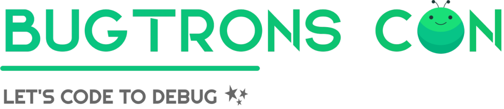

  <h1 align="center"> BUGTRONS CON </h1>

  
 Conferences provide crucial "Roadmaps for Coders" to become Software Developers 

 
 

  <h2 align="center"> SEASON I </h2>

    

| Sr.No. |                 Conference - About                  |                                              Speaker Name                                              |                       Check Out                       |
| :----: | :-------------------------------------------------: | :----------------------------------------------------------------------------------------------------: | :---------------------------------------------------: |
|   1    |             Open Source & Opportunities             |                 Shivay Lamba (CTO @ DarkHorse, GSoC Mentor @ TensorFlow & @ Jenkinsci)                 | <a href="https://youtu.be/wlPQV095brs">Click here</a> |
|   2    |             Let's Flutter with Himanshu             |                  Himanshu Sharma (Incoming MTS @ getvymo & Creator of #GitHubWrapped)                  | <a href="https://youtu.be/v26cRYUJTWE">Click here</a> |
|   3    |         The Surprising Power of Remote Work         |                Santosh Yadav (GitHub Star - India & Google Developer Expert - Angular)                 | <a href="https://youtu.be/3IA34ubhSXA">Click here</a> |
|   4    | Developer Portfolio - NextJS, Storyblok and Postman |                        Abir Pal (SDE @ getcodiga & Student Leader @ getpostman)                        | <a href="https://youtu.be/D8V6QNU8nis">Click here</a> |
|   4    | Developer Portfolio - NextJS, Storyblok and Postman |                        Abir Pal (SDE @ getcodiga & Student Leader @ getpostman)                        | <a href="https://youtu.be/D8V6QNU8nis">Click here</a> |
|   5    |        Rust Kickstart - WASM and Blockchain         |             Faisal Ahmed Farooq (Junior Rust Engineer @ Polkadex & Author @ EducativeInc)              | <a href="https://youtu.be/ElqmYoYudAs">Click here</a> |
|   6    |               Web 3.0 with Hack Club                |                         Harsh Bajpai (SWE & Community Manager APAC @hackclub)                          | <a href="https://youtu.be/6GmcZ30IzIk">Click here</a> |
|   7    |           Hackathon Ecosystem: Hack2skill           |                             Anuj Sharma (Lead Community Team @ Hack2Skill)                             | <a href="https://youtu.be/OgIEBBHKaSY">Click here</a> |
|   8    |       Introduction to DevSecOps: K8s & Docker       |                            Sangam Biradar (Technical Advocate at Tenable®)                             | <a href="https://youtu.be/myuaUkQnRLQ">Click here</a> |
|   9    |  'Building Extensions' for Microsoft Edge Add-ons   |                              Siv Souvam (DevRel @ Microsoft Edge Add-ons)                              | <a href="https://youtu.be/QJxgGxgOadU">Click here</a> |
|   10   |     Entrepreneurship & Product 101: Hack2Skill      | Kaushik Roy (Lead Engineering & Product Team @ Hack2Skill, Research Collaborator @ Microsoft, GSoC’19) | <a href="https://youtu.be/CdUbQE1kDWY">Click here</a> |

 
 

  <h3 align="center"> Founding Organizer </h3>

    <table>
        <tr>
            <td align="center">  <h4 style="color:white;">@ aminoxix</h4>
        </tr>
    </table>

 
 

  <h2 align="center"> SEASON II </h2>

  <b align="center"> Coming soon... 🥳</b>

 

  <h3 align="center"> Founding Organizer </h3>

    Coming soon!

